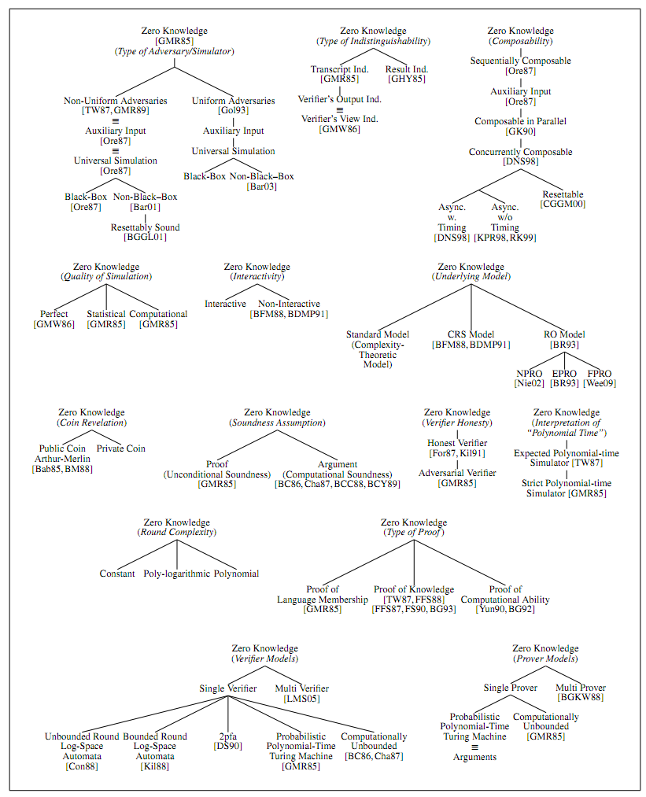

Zero Knowledge

ZKP, NIZKP, etc

Summary:

Zero-Knowledge -> adversary corrupts V -> simulatable -> blackbox, rewindable access to V* -> simulator in place of P -> learn challenge, rewind, simulate

Proof of Kowledge -> adversary corrupts P -> extractability -> blackbox, rewindable access to P* -> extractor in place of V -> learn response to one challenge, rewind, learn response to others

===

ZKP:

===

ZKPs:

1) Actual Proof: sound (answer convincingly), special soundness (answer convincingly because of b,c,d and b,c',d'), proof of knowledge (extractable)
2) Keeps secret: HVZK (transcript with same distro given y), SHZK (transcript with same distro given c), ZK (simulateable)

Schnorr (and Sigma-Protocols): special soundness but not extractable (because challenge may be same on rewind due to dishonest verifier via Fiat-Shamir), SHZK but not ZK (because of dishonest verifier and Fiat-Shamir) but can be ZK for small (poly) challenge space

Zero-knowledge: (a) perfect, (b) statistical, (c) computational

-> how powerful can the verifier be? (a) Unbounded will get zero knowledge, (b) unbounded will get epsilon knowledge, or (c) unbounded will get knowledge (but bounded will get epsilon).

Proofs: (a) proof, (b) argument

-> how powerful can the prover be? (a) Unbounded and proof will still be sound or (b) unbounded and the proof will not be sound (but bounded will be sound)

Verifier: (a) honest, (b) dishonest

-> does the verifier follow the protocol? (a) yes and if they don't, it might not be ZK, or (b) it doesn't matter.

Soundness: (a) special soundness

-> (a) seeing <commit, challenge, response> and <commit, challenge', response'> allows one to extract knowledge (which is why commit should change every time) (however this does say something about the meaningfulness of the conversation)

Witnesses: (a) indistinguishable and/or (b) hiding

-> This concept is a bit tricky: example, we want to prove a graph has a hamiltonian cycle. The hamiltonian cycle itself is a witness to the fact that the graph has a hamiltonian cycle. In fact, there may be more than one cycle and thus more than one witness.

-> If the transcript does not leak information about which witness we use in the proof, it is (a) WI. If there are more than one statistically distinct witnesses and the protocol is WI, then it is WH. WH are sound/hiding under composition. 

Proof components: (a) simulator and (b) extractor

-> if an efficient simulator exists, then the proof is zero-knowledge. (Seems like: simulator is unbounded but must simulate in bounded time?). Simulators are shown to exist by giving the simulator (~prover) black-box access to the verifier.

-> if an efficient extractor exists, then the proof is a proof of knowledge and is sound (see special soundness above for one class of extractors). Extractors are shown to exist by giving the extractor (~verifier) black-box access to the prover.

-> If simulation is too hard, seems to indicate that transcript leaks information about the secret. If it is too easy, then can't distinguish between simulated and non-simulated transcripts. Idea: give the simulator extra power

Simulators: extra power: (a) rewindable access, (b) non-blackbox acces, (c) aux string or CRS, (d) RO

-> simulators are given access to V*'s random tape -> this does not help with blackbox (proven) as selecting random coins can be hardwired into the program (e.g., Fiat-Shamir)

-> Rewindable is suitable for showing stand-alone ZK. For composable (and constant round~=negligible soundness error), need a straight-line simulator.

-> non-blackbox access: ?

-> CRS: ?

-> simulator gets to control the RO. This allows him to reference queries and thus learn every preimage (which may contain secrets). A stronger assumption is that he can program the RO, thus learning how it will respond before the preimage is even defined (useful in simulating Fiat-Shamir, for example).

Sigma protocols:

-> simulatable with an honest verifier

-> extraction with special soundness

-> can be made non-interactive with Fiat-Shamir (and secure against malicious verifier)

-> 3-move: given statement and witness: pledge, challenge, response

Commitment from ZKP:

-> any sigma protocol ((g,y),(x),(b,c,d)) can be made into a commitment scheme by setting c=m, publishing ((g,y),(b)), and opening with (c,d). Commitment is binding only if committer does not know (x).

Sigma to ZKP:

Trapdoor commit to challenge at start [Lindell textbook]

- This is a ZKP but not a PoK 

Coin-tossing to generate challenge: both parties send commitments to challenges and their combined challenge is used [Lindell eprint note]

- This is explicitly a PoK and supports extraction. There is a general problem that a dishonest prover may do Fiat-Shamir when generating random values, and thus the extractor will not get different runs to exploit special soundness.

===

Non-interactive

===

Interactivity: (a) interactive, (b) non-interactive w/ Fiat-Shamir, (c) non-interactive w/ beacons, and (d) non-interactive

-> this distinction affects the zero-knowledge aspect only, and thus the simulator (Is this true?)

-> in interactive proofs, the simulator can exist with rewinds. Guess challenge, if wrong, rewind and try again.

-> in non-interactive proofs with Fiat-Shamir, the simulator can exist if it controls the random oracle. It pre-generates a uniformly random challenge, simulates a proof, and then when the verifier queries the RO, it sets the pre-generated challenge as the response (it can actually do this in advance by querying it itself since it knows the query: a fact that I don't think is useful). This is called programming the RO.

-> in non-interactive proofs with Fiat-Shamir, the extractor can also exist if it controls the random oracle. It executes one run of the protocol, rewinds the prover to after the pledge but before it queried the RO with the pledge, follows the RO functionality by uniformly generating a response, and the challenge will be different (with overwhelming probability). This also requires that the exact value of the pledge has never been queried before -- which is fine in the stand-alone setting. FS00 call this forking.

-> with beacons (modelled as coin tosses at set times), can rewind to before beacon and get new value -> allows extraction. Appears to no longer allow simulation, however if used with small challenge space, simulation can still be done.

-> in the non-interactive setting with pairings, I don't know about simulators

NIZKP is one-round. One-round zero-knowledge does not exist for languages not in BPP. Therefore any NIZKP must use a random oracle or common reference string. 

Other non-interactive: (a) online extractors, (b) deniable arguments...

-> cZK with online extractors (in RO model) [], output transcript for chal=0, hash everything, if hash ends with k zero's: output; otherwise repeat with chal=chal+1.

-> simulatable because simulator programs the RO

-> extractable because RO knows the queries and thus the full transcripts for each failed attempt. Can use these to extract witness. Number of zeros is set so extraction is probable. Extractor does not need to program the RO

-> proof of knowledge because even through challenges are known ahead, can only simulate by changing the pledge value for each challenge. However this requires the same pledge for all challenges.

-> cZK via compiling Sigma-protocol into deniable argument []: V makes up a statement/witness and proves it with a Fiat-Shamir NIZKP Sigma-protocol. The prover then proves that he knows either the witness of the statement in question or the witness that V just made up and issued a proof for. 

-> In RO model, this is cZK: due to FKI06

Sigma to NIZKP in CRS:

-> Only works for ZKPs that are *not* PoK

-> Lindell eprint

-> CRS is g,h for a “double” Pedersen commitment construction 

-> Schnorr: Send {b=g^a, c=H(param,Comm(b,r)), d=a+cx, r}

-> Simulator: chooses any d, chooses any value Comm(b,r), computes c, computes b, and finds r (using CRS) to make relation between Comm(b,r) and b work. No random oracle programming is needed. 

-> Extractor: Run {b,c,d,r} and rewind to {b,…} and new r will be chosen leading to new challenge and extract via special soundness -> seems to work only when r is not deterministically built from b 

-> Why is it not sufficient for PoK?

​	* Pedersen is computationally sound

​	* Given an adversary that can break soundness of ZKP, can we construct an adversary that can break binding of Pedersen? 

===

UC-Framework

===

Composition: (a) sequential, (b) parallel, or (c) concurrent

-> given a proof with soundness 1/2, sequential composition can be simulated. For each round, the simulator succeeds with probability 1/2, and therefore can complete k rounds in expected 2k time. This is ppt-bounded.

-> with parallel composition and an honest verifier, the simulator can try the proof, see the challenge, and then rewind. In the second run, the verifier (honest) will output the same challenge. Therefore the simulator can succeed even though the challenge space is 2^k. 

-> with parallel composition and malicious verifier, the simulator must succeed with all trials in the same round. So for k trials, it has to rewind until all k succeed in the same round, with probability 2^(-k). This is not ppt-bounded. 

 -> if the verifier must pre-commit to their randomness, then the simulator can rewind to after the commitment and it becomes simulatable again (with a malicious verifier and parallel composition). However we then lose extractability (although the use of a trapdoor commitment may allow extractability?). Seems hard to achieve both simulatability and extractability for parallel composition and a dishonest verifier. 

-> if the verifier pre-commits to their randomness, concurrent zero knowledge is not possible. The verifier (malicious) will start the pre-commit and pledge stages for n proofs and then complete them in reverse order. In addition, it can use a Fiat Shamir type approach to select the challenges for round n+1 based on round n. The prover will go through the first n halves and then finish the nth round rewinding as above. Next it will attempt to finish to n-1th round, recover the challenge, rewind to the first half of round n-1 and change its pledge, and then finish--except that in changing its pledge, it changes the challenge for round n (since the verifier is using Fiat-Shamir-type approach) and the prover lose the simulated transcript for round n. The only solution to run all n to completion, rewind on the last challenge (first), then rerun the remaining n-1 to completion, rewind on it, etc. This takes exponential work (apparently) in the plain model. 

-> With actual Fiat Shamir protocols, seems fine in the concurrent setting (however I haven't seen this formalized for sure).

UC-Sigma-Protocols:

-> A sufficient conditions is to show straight-line (no rewinds) simulators and extractors

-> General transformation (Hazay-Nissim heuristic) from a Sigma-protocol to a UC-Sigma-protocol with a UC-commitment

-> Verifier precommits to challenge with UC-commitment

 

Straight-line Simulator:

-> Use extractability of UC-commitment

-> Learn challenge from commitment and simulate proof

Straight-line Extractor:

-> Use extractability of UC-commitment to learn all responses

-> Commit to a response for every possible challenge (when challenge space is small)

-> Note since challenge space is restricted, no longer honest verifier, can scrap pre-commitment to challenge

-> Challenges can still be long, just fix two possible values

Efficiency: 

->Sigma-protocol plus 3L commits and 2L opens

-> Lindell's UC-commitment is 5 mod exps to commit and 21 to open

===

Other Models

===

Non-blackbox

-> Blackbox access must rely on rewinding: straight-line is impossible: technically, a constant-round proof and strict poly simulator is not possible without non-blackbox access

-> Non-blackbox arguments shown by Barak

-> Essentially, prover proves statement or something about a commitment to the verifier's program it cannot possibly prove except under simulation with non-blackbox access

-> The simulator is more powerful here than with blackbox access: not only can they rewind, they can know the verifier's exact program: Prog. In trade for more power, the simulation is strictly polynomial (instead of expected polynomial) as it is straight-line 

-> Verifier defines a hash function h and prover/simulator sends commitment c. Verifier chooses challenge r. Prover provers statement or that c=Commit(h(Prog)) and r=Prog[c] where Prog is the verifier's program (since c is the only thing supplied by the verifier, either r is generating randomly which is fine b/c simulator has V*'s random tape or V* is using a Fiat-Shamir type trick so showing that c leads to r is sufficient).  

-> Simulator doesn't need to "understand" anything about Prog, only needs the description of it (plus blackbox access to predict r). 

===

Uncatogrized

===

-> Aux string

-> Common reference string

-> Resettable

-> Deniable

===

