# Crypto Dreamers

Even in the relatively short time I've been publishing papers, I have been a little dismayed at the direction our conferences (in security, privacy, and cryptography) are heading. Recently, Joseph Bonneau articulated this extremely well on the ZK Podcast:

> If you read crypto papers from the 90s, they're quite short, they get right to the point. Now, you could say we didn't know as much, the field wasn't as deep then, which is true. But I also think that the expectation has become that you can't just present a new idea. You have to present the idea and completely exhaust all feasible analysis of it before people will publish it at big academic crypto conferences. And I think that leads to a l.ot of premature optimization, where researchers have to spend a huge amount of time working out the details of some new idea that more than likely is never going to get picked up or will fail for reasons that don't have to do with some subtle detail of how you prove the thing is secure.
>
> So I have always wanted, if there's a way to do it, to get back to a space where people publish the idea first, you get some feedback from the community, is this idea interesting? And you can always do the deep analysis later if there's sufficient interest in the idea itself. So I've wanted to do that with other ideas as well. In this case ["Naysayer Proofs" paper], I really said we can really present this idea succinctly and have a really nice short write up that will be readable.

## The Gamma Curve

Here is my simplification that captures what I have observed and Joe talks about. Think about research papers along two dimensions: novelty and technicality. Novelty is how ground-breaking the insight behind the research idea is and how useful the idea is. Technicality is how well-executed the analysis of the idea is.

Consider seven fictitious papers (A--G) might be placed along these dimensions as follows:

Let's think about these papers:

* Paper A is an ideal paper that has a novel idea and is executed well. It is the type of paper that is tipped toward acceptance at top venues, awards, and citations. And deservedly so. 
* Paper B has become the run-of-the-mill paper at top conferences. It lacks novelty but makes up for it by slighly over-the-top technical analysis, resulting from high amounts of work. Paper B might creep into this territory after rejection/revision cycles if the authors unwilling to settle for a mid-tier conference. Paper B is hard to review because the correctness hinges on analysis that is so technical, few researchers have the expertise to evaluate it competently. The actual experts might form an informal inner circle that benefits from papers in their niche being published. 
* Papers C--E. As you move away from the top venues, there is a large set of mid or lower tier venues willing to scoop up papers. Sometimes the venues specialize in specific sub-areas, other times they remain general venues (all of security or all of crypto, for example), just a lower bar to acceptance. Papers C and D are tipped toward a mid tier venue, while E and F might find themselves a low tier venue. 
* Paper G is a tough paper to have written. There are fewer and fewer venues that will accept it. Authors might abandon publishing it (beyond a technical report) or decide it is worth the investment into analysis to walk it upward the chart to high technicality. 

Creating a chart with real papers would be very subjective when it came to rating the technicality and novelty of each paper. So this is just a conjecture, but I suspect you will find papers follow a 𝚪 shape (gamma) which is not some fancy math symbol, but rather the literal shape of the letter --- moving upward before moving rightward (avoiding the bottom right quadrant):

```mermaid
quadrantChart
    title Conferences as field matures (𝚪 curve)
    x-axis Low Novelity --> High Novelity
    y-axis Low Technicality --> High Technicality
    quadrant-1 Ideal Papers
    quadrant-2 Incremental Work
    quadrant-3 Smaller Results
    quadrant-4 Fresh Ideas
_: [0.23, 0.12]
_: [0.26, 0.18]
_: [0.24, 0.28]
_: [0.27, 0.35]
_: [0.22, 0.42]
_: [0.25, 0.52]
_: [0.24, 0.65]
_: [0.26, 0.78]
_: [0.23, 0.87]
_: [0.28, 0.73]
_: [0.32, 0.72]
_: [0.39, 0.77]
_: [0.46, 0.73]
_: [0.51, 0.76]
_: [0.57, 0.74]
_: [0.65, 0.78]
_: [0.72, 0.74]
_: [0.81, 0.77]
_: [0.89, 0.74]
_: [0.93, 0.72]
_: [0.05, 0.15]
_: [0.50, 0.35]
_: [0.10, 0.20]
_: [0.30, 0.10]
_: [0.50, 0.05]
_: [0.20, 0.55]
_: [0.75, 0.45]
_: [0.25, 0.85]
_: [0.60, 0.90]
_: [0.20, 0.40]
_: [0.40, 0.70]
_: [0.65, 0.55]
_: [0.30, 0.50]
_: [0.70, 0.85]
_: [0.45, 0.65]
_: [0.55, 0.80]
_: [0.80, 0.75]
_: [0.85, 0.55]
_: [0.60, 0.35]
_: [0.90, 0.75]



```

## Navigating the Curve

Now if you are a new researcher, how to you navigate this chart? There are a few pragmatic considerations:

* You cannot just come up with highly novel research ideas at will, they are hard to find and might require lateral thinking that only comes after being steeped in area for years. 
* You cannot always crank up the technicality of the analysis at will, you often will have to invest material amounts of time (maybe longer than a graduate degree) to learn the methodology. You may also not have access to experts that can mentor you.
* Researchers sometimes operate under time constraints for publications (finish a PhD, publish before applying for a grant, before tenure/promotion).

I feel like the incentives are for young researchers start with research ideas that, if written up, would be around Paper F, and then walk "upward" the chart, where there are a plethora of venues along the spectrum. Obviously everyone wants to walk all the way up to the top venues but it is not always possible, and the low/mid tier venues are a safety net if you drop off early. 

The problem that I see is that it is very risky to start at Paper F and walk "rightward." Unless if you can swoop upward eventually, you will have difficultly finding a visible venue for your work.

## Examples of technicality:

* Optimizations
* Security proofs: a large amount of scaffolding and simple sketches where the rubber hits the road
* 

* 

## Case Study: Bitcoin's Whitepaper

A favourite pass-time of academic cryptographers (at least the ones I know) is the game of "what would have happened if Satoshi submitted the Bitcoin paper to *CRYPTO 2009* ?" The controversy is not in the outcome, everyone agrees it would be rejected at the earliest opportunity (and not just at *CRYPTO*, likely every mid and even most low tier cryptographic venues). The controversy is in the implication. The Bitcoin paper can claim reasonably to actually have changed the world in a way that 99% of cryptographic papers have not. I suspect it is the #1 highest cited crypto paper of all time (I checked it has surpassed RSA and Diffie Hellman).

## Options

Back to Joe:

> ...But I mean, I'd like for academic conferences and workshops to accept more short papers and to encourage that. So financial crypto, in a way, is a holdout. It's one of the last crypto conferences that explicitly accepts short papers which have to be at most eight pages.

* New Security Paradigms Workshop (NSPW): small, invite-only 
* Organized events (Dagstaul)
* Specialized workshops
* USENIX HotSec
* Financial Cryptography: Short Papers

## Case Study: USENIX HotSec

