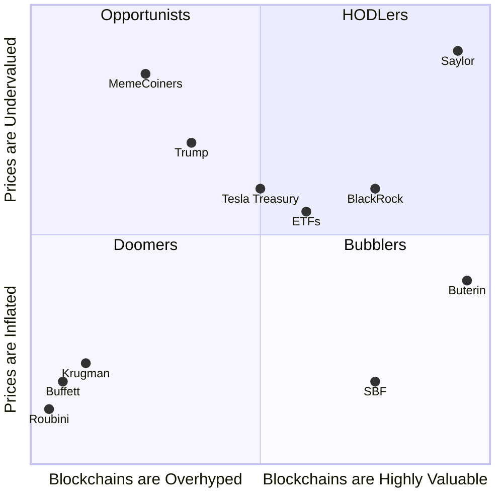

# Is Bitcoin a bubble? 

As a rough pass, opinions on BTC prices fall into four camps:

1) HODLers: BTC offers true utility for users and is also a truly scarce asset and future adoption will continue to drive prices upward. Even if not 100% confident, there is asymmetric upside.
2) Doomers: BTC offers no meaningful utility and its price is driven by new sets of buyers (geeks to wall street to retail to nation states) who buy into the hype ("ponzi"); once buyers run out, prices will collapse to 0.
3) Bubblers: BTC offers true utility for users but speculation ("fear of missing out") has created demand at irrational prices (a "bubble") that will revert ("pop") in the future to prices better aligned with the technology sector.
4) Opportunists: Buyers are excited about BTC regardless of its utility and instead of trying to profit from BTC itself, we can profit from servicing the BTC market.

The chart above gives the quadrants with some totally made up possible values for where famous people or institutes might align themselves. The chart is not strictly about BTC but crypto more broadly while I have defined the terms about relative to BTC specifically.

## Bubblers

I think the lower left (Doomers) and upper right (HODLers) quadrants get a lot of oxygen. The upper left is interesting (Opportunists) quadrants with a more cynical take. The lower right (Bubblers) is what I want to focus on today.

The idea that BTC is a "bubble" means that the price is not reflective of its true value but at the same time its true value is not 0 (otherwise you would be a doomer). For reference, think about the housing bubble in the United States from roughly 1997 to 2006. Those who profited from the bubble (think about the movie "The Big Short") owned houses themselves and were not saying houses have no value (they weren't doomers), they just understood that mortgage delinquency was going to hit the financial sector like a hurricane. Some US companies operating through the roaring 20's still had value at the end, as did many Dot-com companies.

The line between Bubblers and Doomers can get hard to draw. Was Tulip mania (often cited by Doomers) a bubble as well, I mean tulips still had some value as a flower at the end? What about Beanie Babies or Sneakers or NFTs? So bubblers and doomers exist along a continuum with bubblers more likely to believe blockchain technology has some value and doomers thinking blockchains is technobabble to trick people into buying in. 

## How do you know you are in a bubble?

The short answer is you do not. Unless if you have ground truth about the fundamental value of something, you typically do not know until it pops. After it pops, you can see the traits in hindsight but the traits could have been something else. What are those traits? If BTC is a bubble, it is actually a pretty special bubble for how long it has run (might even be the longest running major bubble). It has some of the traits of a bubble but not all of them:

1) Credit
2) Liquidity: Crypto is a liquid market but it is also has been a hard market to enter for the first time historically, which slows down buyers and spreads them out over time. Today most retail buyers who want crypto can buy it. Larger institutions or nation states still have frictions, which means we haven't yet sold BTC to the "last buyer" yet.
3) Fundamentals: BTC has ambigous fundamental value, there are opinions but uncertainity. This keeps BTC prices somewhat unanchored in comparison to say a tech company stock which at least has a book value.
4) Narratives: "housing never goes down, internet will chagne verything, etc. Everyone else is making money off of BTC (even though they are usually UNREALIZED gains on paper)
5) Scarcity: many bubbles pop because the market gets flooded, say new builds or renovated houses during the housing bubble. BTC is scarce which allows the bubble to persist. 
6) HODL cult: BTC maxis

## Arguments for and against being a bubbler

Asymmetric upside despite the bubble?

Cannot profit from being a bubbler (mark stays irrational longer than you can say solvent)

ETH/BTC

